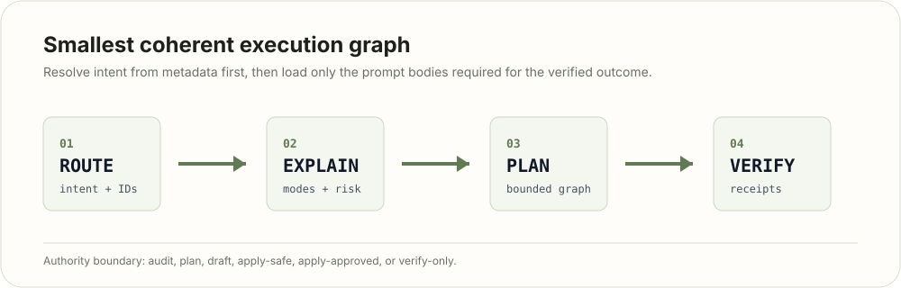
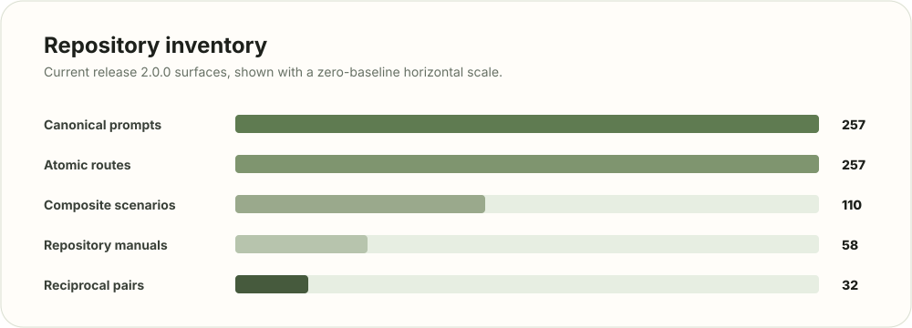

<p align="center">
  
</p>

<p align="center">
  <a href="https://github.com/manojpisini/mission-directives/actions/workflows/validate.yml"></a>
  <a href="https://github.com/manojpisini/mission-directives/actions/workflows/deploy-docs.yml"></a>
</p>

<p align="center">
  <strong>Bounded, reviewable, and verifiable agent work.</strong><br />
  <a href="https://manojpisini.github.io/mission-directives/">Documentation site</a>
</p>

<p align="center">
  
</p>

Mission Directives is a curated prompt and orchestration suite for turning natural-language requests into the smallest coherent prompt, scenario, or workflow graph needed for the outcome. It keeps selection deterministic, authority explicit, and completion tied to evidence instead of asking a model to load a whole library and guess.

Current release: **2.0.1**

<p align="center">
  
</p>

<p align="center">
  
</p>

## What It Provides

- **Deterministic routing:** exact IDs, shortcuts, keyword concepts, route hints, typo recovery, metadata scoring, and calibrated no-match behavior.
- **Stable prompt contracts:** permanent `MD-*` identities, typed inputs and outputs, operating modes, risk levels, evidence lanes, and completion gates.
- **Scenario graphs:** atomic and composite workflows with phases, locks, branches, approvals, assurance requirements, and external-action boundaries.
- **Pinned project runtime:** the installed CLI creates an isolated `.mission-directives/` workspace containing prompts, catalogs, schemas, configuration, outputs, and an independent local viewer.
- **Project context fast path:** schema-validated project knowledge reduces repeated repository scans without granting authority or overriding current evidence.
- **Verification discipline:** every route is complete only when the requested artifact satisfies its task-specific verification contract and residuals are explicit.

<p align="center">
  
</p>

Repository inventory: **257 prompts**, **257 atomic routes**, **110 composite scenarios**, **32 reciprocal investigation/execution pairs**, and **62 repository manuals**.

<p align="center">
  
</p>

## How It Works

```text
request
  -> parse MD invocation, exact IDs, intent, depth, and assurance modifiers
  -> resolve shortcut owners and candidate metadata without loading prompt bodies
  -> rank prompt, scenario, pack, and skill candidates
  -> explain the selected graph, modes, inputs, approvals, and verification duties
  -> plan or execute inside the declared authority boundary
  -> verify the exact result and record evidence, unknowns, residuals, and receipts
```

Prompt numbers are stable addresses, not lifecycle state. Department packs help discovery; they are not bundles to load in full.

<p align="center">
  
</p>

## Requirements

- Python 3.11 or newer.
- Git is required for normal development.
- PowerShell 7 is recommended for Windows wrappers.
- Bash is required only for POSIX wrappers.
- The documentation site uses `pnpm`.

Runtime dependencies for installed projects are in [requirements-runtime.txt](requirements-runtime.txt). Repository development and validation dependencies are in [requirements-dev.txt](requirements-dev.txt).

<p align="center">
  
</p>

## Quick Start

```bash
uv tool install mission-directives
cd /path/to/project
mission-directives init --tracking ignored
mission-directives config validate
mission-directives route "MD advanced audit fix verify repository"
mission-directives view
```

`pipx install mission-directives` and `python -m pip install --user mission-directives` are also supported. The `mission-directives` executable is used deliberately; `md` is already an all-scope PowerShell alias.

<p align="center">
  
</p>

## Install Into a Project

Initialize the current directory or an explicit project path:

```bash
mission-directives init
mission-directives init /absolute/path/to/project --tracking outputs
```

The initializer stages and verifies the declared runtime payload before promoting it to `.mission-directives/runtime`. It also creates Project Config, the independent local viewer, seven output categories, managed guidance blocks, state receipts, and the selected `.gitignore` policy in one rollback-capable transaction.

Tracking modes are `ignored` (ignore the full workspace), `outputs` (track Project Config and output categories), and `all` (track the pinned runtime and local site while ignoring transient state). Existing managed installations can use `mission-directives upgrade`; legacy managed layouts use `mission-directives migrate . --dry-run` before `--apply`.

<p align="center">
  
</p>

## Daily Usage

Route the full request:

```bash
mission-directives route "MD advanced repository mission drift and simplification audit"
mission-directives lookup "cleanup dead code safely" --limit 8
mission-directives compare C-108 C-63
mission-directives explain C-108
mission-directives plan C-108 --mode AUDIT_ONLY --root . --dry-run
```

Installed-project routing dispatches through the pinned `.mission-directives/runtime`, so a later global package upgrade cannot silently change project behavior.

## Project Config and Outputs

`.mission-directives/project.json` is a validated project knowledge cache. Agents read it before broad discovery, then verify only fields that are missing, stale, contradicted, or material to a high-risk decision. Current user instructions and repository evidence always win; the config cannot authorize mutation, deployment, publication, credentials, or external actions.

```bash
mission-directives config show
mission-directives config validate
mission-directives config refresh --dry-run
mission-directives config open
```

Existing logical paths under `results/`, `reports/`, `artifacts/`, `plans/`, `outputs/`, `docs/`, and `logs/` resolve beneath `.mission-directives/`. `mission-directives view` serves those unchanged files through a loopback-only Uvicorn application with category indexes, Markdown articles, attachment previews, Project Config editing, and an authorized shutdown control. Restart it from any project subdirectory with the same command.

Common entry points:

| Request | Route | Purpose |
| --- | --- | --- |
| Clarify route-changing ambiguity | `MD-191` | Ask only questions that alter authority, evidence, output, budget, or acceptance criteria. |
| Add or refine a prompt | `MD-199` | Review overlap, normalize, register, test, and add one prompt. |
| Audit, fix, and verify | `C-108` | Run a convergent remediation workflow. |
| Deep research | `C-26` | Produce an evidence-backed research report. |
| Professional report | `C-95` | Build and verify a report pipeline. |
| Feature delivery | `C-63` | Plan, implement, test, and document a feature. |
| Prompt engineering | `C-94` | Create, optimize, evaluate, or repair prompts. |
| Personal work system | `MD-138` | Organize goals, projects, tasks, notes, and decisions. |

<p align="center">
  
</p>

## Operating Modes

| Mode | Boundary |
| --- | --- |
| `AUDIT_ONLY` | Inspect, retrieve, analyze, compare, and report without mutation. |
| `PLAN_ONLY` | Produce plans, specifications, decisions, or acceptance criteria. |
| `DRAFT_ONLY` | Produce local drafts without implying publication or acceptance. |
| `APPLY_SAFE` | Make reversible local changes inside explicit authority. |
| `APPLY_APPROVED` | Perform the exact approved consequential action with receipts and recovery controls. |
| `VERIFY_ONLY` | Independently verify an artifact or claimed result without changing it. |

<p align="center">
  
</p>

## Documentation Site

The documentation site is a static Astro build that uses the checked-in landing/documentation HTML, CSS, and JS shell. The generator publishes a sectioned documentation hub: `docs.html` for overview, `guides.html` for task guides, `manuals.html` for the generated manual library, `reference.html` for runtime contracts, `prompts.html` for every prompt, `scenarios.html` for atomic and composite scenarios, `pairs.html` for reciprocal pairs, and every root `docs/*.md` file as a static manual page under `reference/manuals/`.

```bash
cd site
pnpm install
pnpm run generate
pnpm run build
pnpm run check
```

<p align="center">
  
</p>

## Repository Layout

| Path | Purpose |
| --- | --- |
| `prompts/` | Canonical prompt bodies. |
| `catalog.json` | Prompt identities, metadata, and relationships. |
| `SCENARIO_CATALOG.json` | Atomic and composite route graphs. |
| `config/` | Router keywords, runtime payload allowlist, templates, packs, and capability graph. |
| `policies/` | Authorization, evidence, routing, install, loop, and agent guidance policies. |
| `schemas/` | Typed contracts and imported source schemas. |
| `tools/` | Router, installer, generators, validators, and wrappers. |
| `src/mission_directives/` | Packaged CLI, project lifecycle, Project Config, and local viewer. |
| `pyproject.toml` | Public Python distribution metadata and console entry point. |
| `docs/` | User, operator, authoring, security, and maintenance manuals. |
| `site/` | Static documentation site source. |
| `tests/` / `evaluations/` | Repository-only validation and evaluation assets. |

<p align="center">
  
</p>

## Validation

Before committing runtime, manifest, prompt, schema, docs, or site changes, run the smallest checks that cover the touched surface. For broad changes:

```bash
python tools/build_manifest.py
python -m pytest
python tools/validate_suite.py
uv build
python tools/package_smoke.py dist
cd site && pnpm run check
```

`tools/validate_suite.py` checks structural contracts, deterministic runtime tests, fixture coverage, identity contracts, CI configuration, lock safety, generated artifact reproducibility, and manifest integrity. It does not certify live model quality or external-world outcomes.

Before every broad push, follow the complete ordered checklist in the [GitHub Actions Failure History and Pre-Push Guide](docs/GITHUB_ACTIONS_FAILURE_HISTORY_AND_PRE_PUSH_GUIDE.md). It records all 30 historical validation failures, their fixes, cross-platform prevention rules, the Node 24 action baseline, and the package/site checks required before a push.

Repository agents read [MEMORY.md](MEMORY.md) before workflow, manifest, release, installer, wrapper, documentation-generation, or publishing changes and append only verified durable lessons after completion.

<p align="center">
  
</p>

## Contributing

Start with the [Contributor Guide](docs/CONTRIBUTOR_GUIDE.md) and [pre-push guide](docs/GITHUB_ACTIONS_FAILURE_HISTORY_AND_PRE_PUSH_GUIDE.md). Keep prompt identities stable, update generated registries through their owning tools, add focused regression coverage, rebuild `MANIFEST.json`, and run the validation commands above. Commit messages use past-tense declarative wording without first-person pronouns, for example `Added packaged runtime validation`.

## License

Mission Directives is available under your choice of [MIT](LICENSE-MIT) or [Apache-2.0](LICENSE-APACHE). See [LICENSE](LICENSE) for the dual-license notice.
